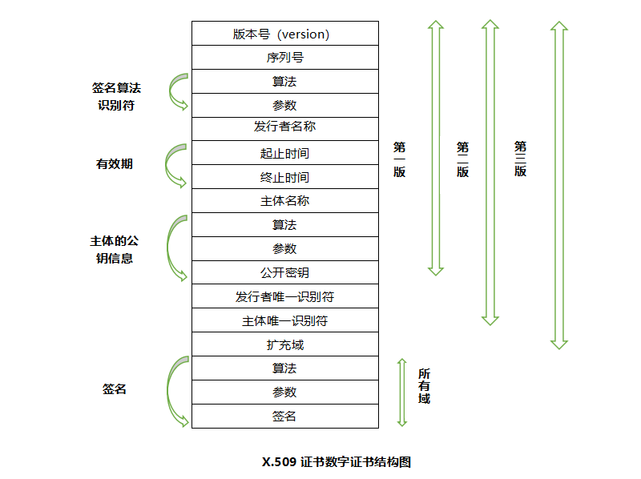
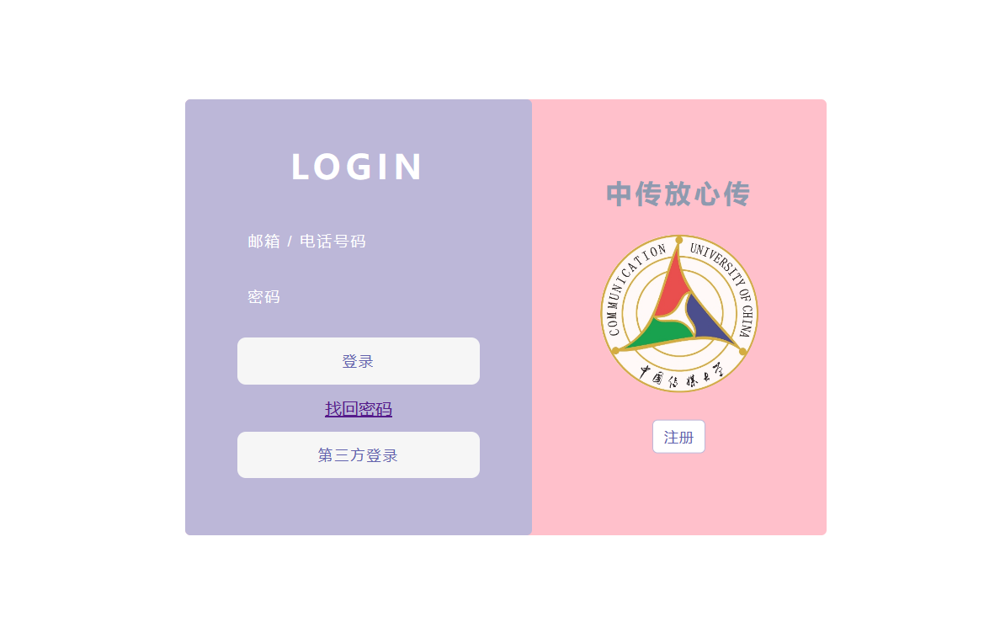

# 王路遥 的工作报告
王路遥2021212063022

## 个人贡献

- 证书部分
- 前端部分
- 注册部分
- 视频录制讲解剪辑

## 证书部分

### 数字证书简介

数字证书是一种权威性的电子文档，它提供了一种在 Internet 上验证身份的方式。它是由一个权威机构——CA证书授权(Certificate Authority)中心发行的，人们可以在互联网交往中用它来识别对方的身份。即以数字证书为核心的加密技术可以对网络上传输的信息进行加密和解密、数字签名和签名验证，确保网上传递信息的机密性、完整性，以及交易实体身份的真实性，签名信息的不可否认性。当然在数字证书认证的过程中，数字证书认证中心（CA）作为权威的、公正的、 可信赖的第三方，其作用是至关重要的。数字证书也必须具有唯一性和可靠性。

### PKI

PKI（Public Key Infrastructure 即公钥基础设施）是一种遵循既定标准的，采用密码技术为网上安全通信提供一整套安全服务的基础平台，能够为所有网络应用提供信息加密和数字签名等密码服务及所必须的密钥与证书管理体系。也就是能够对公私钥对进行管理，支持身份验证、机密性、完整性以及不可否认性服务的具有普适性的信息安全基础设施。

### PKI X.509

#### PKI X.509简介
数字安全证书的格式遵循itut x.509国际标准。

X.509证书有两种一种由CA机构颁发的，一种为自签名证书。因为域名所有经过者无需经过任何验证即可获得证书，前者可信度更高，而后者的可信度较低。颁发证书其实就是使用CA的私钥对证书请求签名文件进行签名。

我们使用的为自签发证书，需要安装 ` cryptography ` 模块，因为其含有常见的加密算法。

        from cryptography.hazmat.primitives import serialization
        from cryptography.hazmat.primitives.asymmetric import rsa
        from cryptography import x509
        from cryptography.x509.oid import NameOID,ExtensionOID
        from cryptography.hazmat.primitives import hashes

但具体进行时发现浏览器不认可，最好还是换用权威CA办法的证书。

#### PKI X.509结构

如我们项目中的证书结构

    subjectInfo=issuer=x509.Name([
        x509.NameAttribute(NameOID.COUNTRY_NAME, u'CN'),
        x509.NameAttribute(NameOID.STATE_OR_PROVINCE_NAME, u'BeiJing'),
        x509.NameAttribute(NameOID.LOCALITY_NAME, u'BeiJing'),
        x509.NameAttribute(NameOID.ORGANIZATION_NAME, u'bigfly'),
        x509.NameAttribute(NameOID.ORGANIZATIONAL_UNIT_NAME, u'bigfly'),
        x509.NameAttribute(NameOID.COMMON_NAME, u'pan.bigfly.com'),
        x509.NameAttribute(ExtensionOID.SUBJECT_ALTERNATIVE_NAME, u'DNS:pan.bigfly.com'),
    ])

结构如下图表示

版本号：标识证书的版本

序列号：标识证书的唯一整数，由证书颁发者分配的本证书的唯一标识符。

签名：证书的算法标识

颁发者：

| 类型 | 含义 | 简写 |
| :---: | :---: | :---: |
| Common Name | 通用名称 | CN |
| Organizational Unit name	 | 机构单元名称	 | OU |
| Organization name | 机构名 | O |
| Locality | 地理位置 | L |
| State or province name | 州/省名 | S |
| Country | 国名 | C |

有效期:证书有效期的时间段.

主体:证书拥有者的可识别名.

主体公钥信息:主体的公钥。

颁发者唯一标识符:标识符—证书颁发者的唯一标识符.

主体唯一标识符:证书拥有者的唯一标识符.

## 前端部分

### 搭建前端

前端技术：HTML CSS JS

后端技术：Flask Python3.10

前端部分搭建了 ` login ` 界面和 ` register ` 页面搭建

利用在线工具 [enjoy css](https://enjoycss.com/)进行css编写尝试

参考

### 第三方登录

关于第三方登录进行了详细研究，但因证书、第三方登录申请时间过长等问题无法实际实现，仅写入部分代码待后续开发接入

微信登陆：

需要企业资质，可申请公众号

[微信oauth2授权登录实践](https://blog.csdn.net/qq_39506978/article/details/109410343?utm_medium=distribute.pc_relevant.none-task-blog-2~default~baidujs_utm_term~default-5-109410343-blog-78492685.pc_relevant_sortByStrongTime&spm=1001.2101.3001.4242.4&utm_relevant_index=8)

支付宝登陆：

[Outh2.0----支付宝接入](https://blog.csdn.net/weixin_43640375/article/details/108688459)

微博登录：

[OAuth2.0微博](https://open.weibo.com/wiki/%E6%8E%88%E6%9D%83%E6%9C%BA%E5%88%B6)
### 前端部分参考资料

[HTML 教程](https://www.runoob.com/html/html-tutorial.html)

[CSS3 教程](https://www.runoob.com/css3/css3-tutorial.html)

[JavaScript 教程](https://www.runoob.com/js/js-tutorial.html)

询问师哥及同学

## 注册部分

### 允许用户注册到系统

开放注册功能

### 用户名规则

1.15 个字符以内

2.只允许使用中文、英文字母、数字： 使用正则表达式限制输入的字符类型： 

    <input οnkeyup="value=value.replace(/[^\w\u4E00-\u9FA5]/g, '')">

### 密码规则

1.至少需要同时包含大、小写字母和数字，长度不小于8位不大于15位：

使用正则表达式 
    
    /^(?=.*?[A-Z])(?=(.*[a-z]){1,})(?=(.*[\d]){1,})(?=(.*[\W]){1,}).{8,15}$/

2.口令强度设计为 弱-中-强 三级，弱口令无法注册 参考以下代码：

    //CharMode函数
    //测试某个字符是属于哪一类.
    function CharMode(iN){
        if (iN>=48 && iN <=57) //数字
    return 1;
    if (iN>=65 && iN <=90) //大写字母
    return 2;
    if (iN>=97 && iN <=122) //小写
    return 4;
    else
    return 8; //特殊字符
    }
    //bitTotal函数
    //计算出当前密码当中一共有多少种模式
    function bitTotal(num){
    modes=0;
    for (i=0;i<4;i++){
    if (num & 1) modes++;
    num /= 2;
    }
    return modes;
    }
    //checkStrong函数
    //返回密码的强度级别
    function checkStrong(sPW){
    if (sPW.length<=4)
    return 0; //密码太短
    Modes=0;
    for (i=0;i
    //测试每一个字符的类别并统计一共有多少种模式.
    Modes|=CharMode(sPW.charCodeAt(i));
    }
    return bitTotal(Modes);
    }
    //pwStrength函数
    //当用户放开键盘或密码输入框失去焦点时，根据不同的级别显示不同的颜色
    function pwStrength(pwd){
    O_color="#eeeeee";
    L_color="#FF0000";
    M_color="#FF9900";
    H_color="#33CC00";
    if (pwd==null||pwd==''){
    Lcolor=Mcolor=Hcolor=O_color;
    }else{
    S_level=checkStrong(pwd);
    switch(S_level) {
    case 0:
    Lcolor=Mcolor=Hcolor=O_color;
    case 1:
    Lcolor=L_color;
    Mcolor=Hcolor=O_color;
    break;
    case 2:
    Lcolor=Mcolor=M_color;
    Hcolor=O_color;
    break;
    default:
    Lcolor=Mcolor=Hcolor=H_color;
    }
    }
    document.getElementById("strength_L").style.background=Lcolor;
    document.getElementById("strength_M").style.background=Mcolor;
    document.getElementById("strength_H").style.background=Hcolor;
    }

### 注册时实现的功能

1.检测用户名是否重复

2.判断口令强度是否符合要求

3.判断两次输入的密码口令是否一致

4.判断是否有信息没有填写

详细可见视频中的演示：

[CUC_iCloud](https://www.bilibili.com/video/BV1MP41167KE/?spm_id_from=333.999.0.0&vd_source=73db12613f592227bc706b6e996a5ef0)

### 密码检测

通过JS来检测用户两次输入是否相同。
获取两个输入框中的值进行对比判断，onkeyup事件，使得当用户释放键盘按钮时才执行checkpassword()函数，可以实时监控对比两次的密码。

    <input name="password" id="pw" type="password" class="kuang_txt possword" placeholder="密码(不少于6位)" >
    <input name="repassword" id="repw" type="password" class="kuang_txt possword" placeholder="确认密码" onkeyup="checkpassword()">
    </input>`
    js部分：
    `

### 加密中所使用的算法RSA加密算法和RSA签名算法之间的关系？

RSA加密：RSA密码体制是一种公钥密码体制，加密算法公开，以分配的密钥作为加密解密的关键。

RSA签名：签名就是在这份资料后面增加一段强而有力的证明，以此证明这段信息的发布者和这段信息的有效性完整性。

在使用RSA进行通讯的时候，一般是两者结合，即：加密>签名>解密>验签

公钥加密、私钥解密、私钥签名、公钥验签。

加密和可逆的，而签名是不可逆的

我们可以对一份资料用公钥加密，再用私钥解密，但我们对这份资料进行签名则是不可逆的，因为哈希本身是不可逆的。

加密和签名都涉及到了使用公钥加密，前者加密了信息，后者加密了信息的hash

加密和签名都是为了安全性考虑，但略有不同。加密是为了防止信息被泄露，而签名是为了防止信息被篡改。

为什么签名是对信息hash之后加密，而不是加密一些特定的字符？

这是因为防止中间人尝试向私钥拥有者反复发送一些特定的字符，得到加密后的信息，达到破解或者伪造之类的目的。所以用私钥随便加密信息是不安全的。

RSA的签名与加密一般用在需要非常安全的环境下，例如支付

代码编写： Cipher 用于加密 Signature 用于签名

总结：
签名的本质其实就是加密，但是由于签名无需还原成明文，因此可以在加密前进行哈希处理。所以签名其实就是哈希+加密，而验签就是哈希+解密+比较。

签名过程：对明文做哈希，拼接头信息，用私钥进行加密，得到签名。

验签过程：用公钥解密签名，然后去除头信息，对明文做哈希，比较2段哈希值是否相同，相同则验签成功。

## 总结

通过学习我对证书颁发体系有了更深的理解，学习了X.509证书体系、密码学的对称加密和非对称加密等知识在理论知识，并进行了实际应用，参与实际了前端设计，对前后端的连接有了更深的理解。希望下次能有机会参与到实际项目开发中来。